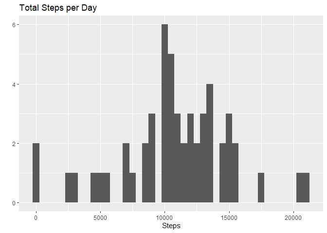
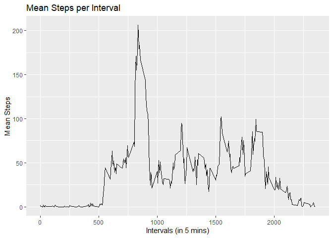
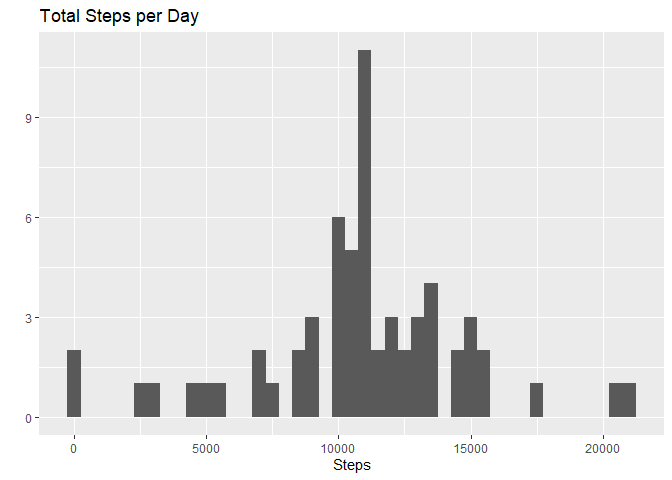
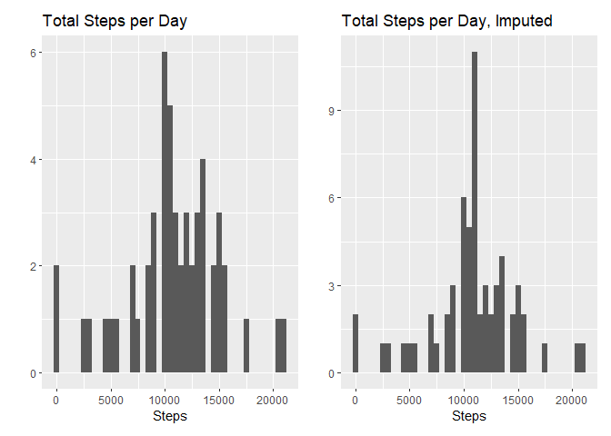
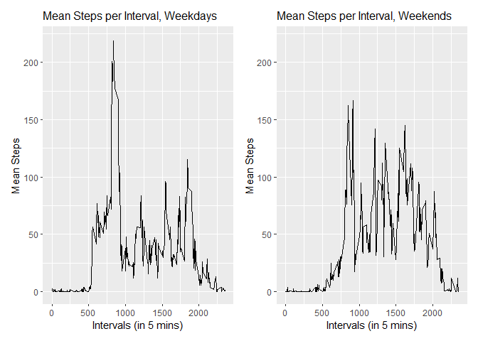

## Loading and preprocessing the data

Let's start by reading in the data for the project.

```r
file <- unzip("activity.zip", "activity.csv")
data <- as_tibble(read.csv(file))
data$date <- as.Date(data$date)
str(data)
```

```
## tibble [17,568 x 3] (S3: tbl_df/tbl/data.frame)
##  $ steps   : int [1:17568] NA NA NA NA NA NA NA NA NA NA ...
##  $ date    : Date[1:17568], format: "2012-10-01" "2012-10-01" ...
##  $ interval: int [1:17568] 0 5 10 15 20 25 30 35 40 45 ...
```

Just to start off our analysis, we'll run a quick summary of the data...

```r
summary(data)
```

```
##      steps             date               interval     
##  Min.   :  0.00   Min.   :2012-10-01   Min.   :   0.0  
##  1st Qu.:  0.00   1st Qu.:2012-10-16   1st Qu.: 588.8  
##  Median :  0.00   Median :2012-10-31   Median :1177.5  
##  Mean   : 37.38   Mean   :2012-10-31   Mean   :1177.5  
##  3rd Qu.: 12.00   3rd Qu.:2012-11-15   3rd Qu.:1766.2  
##  Max.   :806.00   Max.   :2012-11-30   Max.   :2355.0  
##  NA's   :2304
```

We'll remove the NAs from the steps column and work with the resulting dataset for now.

```r
dataNAStepsRM <- data[which(!is.na(data$steps)),]
```

## What are the mean and median total number of steps taken per day?
Now we can aggregate the data by date to find the sum of the steps taken each day.

```r
summaryData <- dataNAStepsRM %>%
      select(date, steps) %>%
      filter(!is.na(steps)) %>%
      group_by(date) %>%
      summarise(sumSteps=sum(steps))
```

```
## `summarise()` ungrouping output (override with `.groups` argument)
```

```r
summaryData
```

```
## # A tibble: 53 x 2
##    date       sumSteps
##    <date>        <int>
##  1 2012-10-02      126
##  2 2012-10-03    11352
##  3 2012-10-04    12116
##  4 2012-10-05    13294
##  5 2012-10-06    15420
##  6 2012-10-07    11015
##  7 2012-10-09    12811
##  8 2012-10-10     9900
##  9 2012-10-11    10304
## 10 2012-10-12    17382
## # ... with 43 more rows
```

We can then produce a histogram of the sum of the steps per day.


```r
qplot(summaryData$sumSteps, xlab = "Steps", binwidth = 500, main = "Total Steps per Day")
```

<!-- -->


Below are the mean and median number of steps taken per day.

```r
mean(summaryData$sumSteps)
```

```
## [1] 10766.19
```

```r
median(summaryData$sumSteps)
```

```
## [1] 10765
```


## What is the average daily activity pattern?
Similarly to the previous aggregation by date, to see the daily activity pattern, we will need to aggregate by interval.

```r
intervalData <- aggregate(dataNAStepsRM$steps, 
                    by = list(dataNAStepsRM$interval),
                    FUN = mean)
names(intervalData) <- c("Interval", "Steps")
```

Now, we'll plot the mean steps per interval.

```r
ggplot(data=intervalData, aes(x=Interval, y=Steps)) + 
            geom_line() + 
            labs(title = "Mean Steps per Interval", 
                 x = "Intervals (in 5 mins)", 
                 y = "Mean Steps")
```

<!-- -->

Finally, we find the interval with the highest mean number of steps.

```r
subset(intervalData, intervalData$Steps == max(intervalData$Steps))
```

```
##     Interval    Steps
## 104      835 206.1698
```


## Imputing missing values
Let's find the number of missing values in the steps column of the original dataset.

```r
sum(is.na(data$steps))
```

```
## [1] 2304
```

A good way to fill in the missing values is to use the mean steps taken at each interval. This way the imputed values fall in line with the time of day.

```r
intervalMedianData <- aggregate(dataNAStepsRM$steps, 
                    by = list(dataNAStepsRM$interval),
                    FUN = mean)
names(intervalMedianData) <- c("interval", "steps")
imputedData <- data %>% left_join(intervalMedianData, by = 'interval') %>%
      mutate(steps = coalesce(steps.x, steps.y))
```

Check to see if there any NAs remaining.

```r
sum(is.na(imputedData$steps))
```

```
## [1] 0
```

Recalculating sums of each day and plotting histogram

```r
summaryImputedData <- imputedData %>%
      select(date, steps) %>%
      group_by(date) %>%
      summarise(sumSteps=sum(steps))
```

```
## `summarise()` ungrouping output (override with `.groups` argument)
```

```r
qplot(summaryImputedData$sumSteps, xlab = "Steps", binwidth = 500, main = "Total Steps per Day")
```

<!-- -->

And just for comparison, the histograms of the imputed data and the non-imputed data side-by-side.

```r
p1 <- qplot(summaryData$sumSteps, xlab = "Steps", binwidth = 500, main = "Total Steps per Day")
p2 <- qplot(summaryImputedData$sumSteps, xlab = "Steps", binwidth = 500, main = "Total Steps per Day, Imputed")
p1 + p2
```

<!-- -->


## Are there differences in activity patterns between weekdays and weekends

We will split our imputed data into two sets, one containing data on weekends, the other on weekdays.

```r
imputedData$weekday <- weekdays(imputedData$date)
imputedData$weekendflag <- ifelse(imputedData$weekday == "Saturday" |  imputedData$weekday == "Sunday", "Weekend", "Weekday")
weekdayImputedData <- imputedData %>%
      filter(weekendflag == "Weekday") %>%
      select(steps, date, interval) 
weekendImputedData <- imputedData %>%
      filter(weekendflag == "Weekend") %>%
      select(steps, date, interval)
```

Now, we'll find the mean steps per interval in the two datasets.

```r
intervalWeekdayData <- aggregate(weekdayImputedData$steps, 
                    by = list(weekdayImputedData$interval),
                    FUN = mean)
intervalWeekendData <- aggregate(weekendImputedData$steps, 
                    by = list(weekendImputedData$interval),
                    FUN = mean)
names(intervalWeekdayData) <- c("Interval", "Steps")
names(intervalWeekendData) <- c("Interval", "Steps")
```

Finally, we'll create our panel plot.

```r
p1 <- ggplot(data=intervalWeekdayData, aes(x=Interval, y=Steps)) + 
            geom_line() + 
            labs(title = "Mean Steps per Interval, Weekdays", 
                 x = "Intervals (in 5 mins)", 
                 y = "Mean Steps") +
            ylim(0, 220) + 
            theme(plot.title = element_text(size=12))
p2 <- ggplot(data=intervalWeekendData, aes(x=Interval, y=Steps)) + 
            geom_line() + 
            labs(title = "Mean Steps per Interval, Weekends", 
                 x = "Intervals (in 5 mins)", 
                 y = "Mean Steps") +
            ylim(0, 220) + 
            theme(plot.title = element_text(size=12))
p1 + p2
```

<!-- -->

